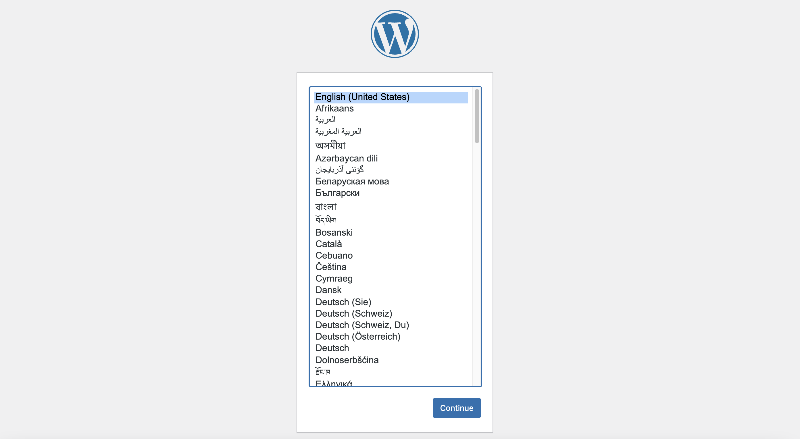

#### 1. Select your preferred wordpress language (English)

#### 2. Enter the information needed by the WordPress (Site title, username, password and email)

Username and password can use the followings: 

Username: `polyu_admin`{{copy}}  
(Use your own username durning your OWN setup)

Password: `$YOnq0I0krJ912Pntj`{{copy}}  
(Use the generated password durning your OWN setup, it creates a strong and unpredictable passwords for your admin account)
 

#### 3. Then click "Install WordPress" to continue

