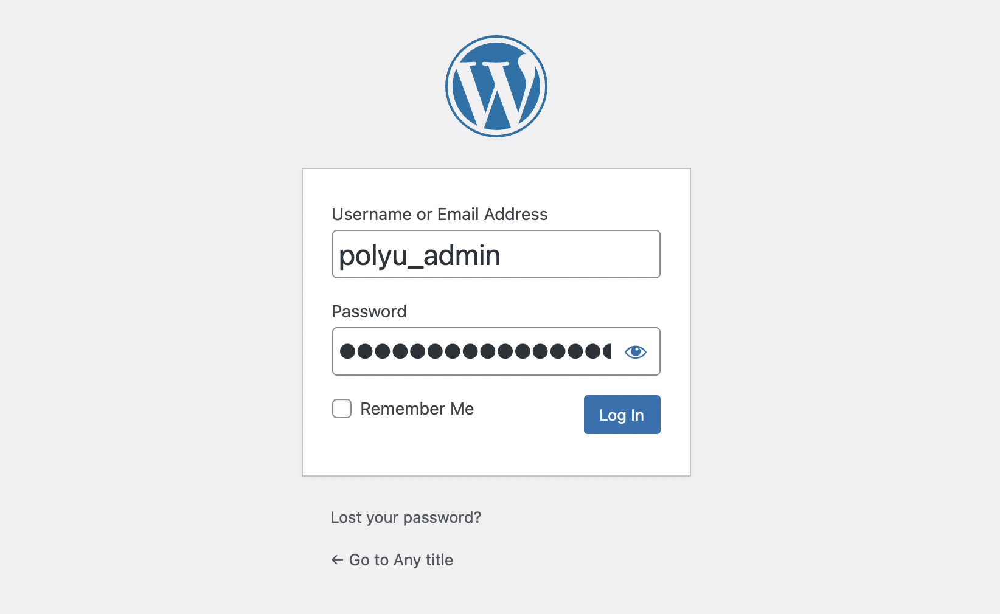

#### 1. Select your preferred wordpress language (English)

 

#### 2. Enter the information needed by the WordPress (Site title, username, password and email)

You can use the followings for username and password: 

Username: `polyu_admin`{{copy}}
 
(Use your own username durning your OWN setup)

Password: `$YOnq0I0krJ912Pntj`{{copy}}
 
(Use the generated password durning your OWN setup, it creates a strong and unpredictable passwords for your admin account)
 

 

#### 3. Click "Install WordPress" to continue

 

#### 4. Click "Login" to continue

 

#### 5. Fill in the login credentials that we set up in step 2 and login in to the dashboard

Username: `polyu_admin`{{copy}}
 
 
Password: `$YOnq0I0krJ912Pntj`{{copy}}
 

