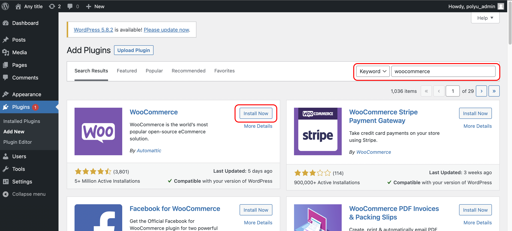
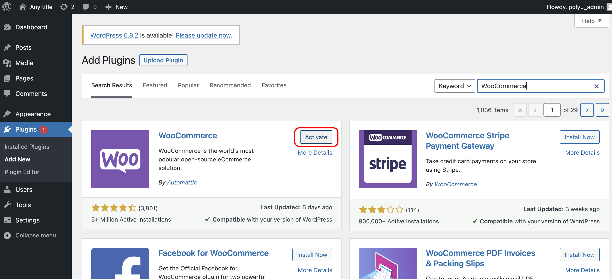

#### 1. Go to plugin page

#### 2. Click "Add New" button

#### 3. Search for **WooCommerce** and click "Install Now"

Search for `WooCommerce`{{copy}}

#### 3. Then click "Active" to active the plugin

